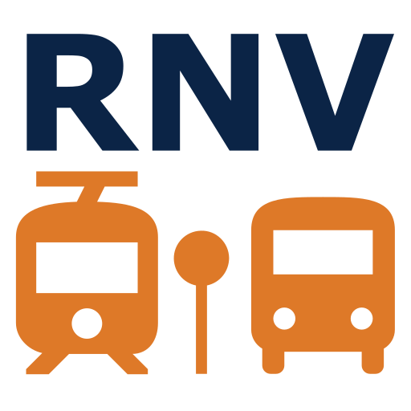

[![GitHub Release][releases-shield]][releases]
[![Maintainer][maintainer-shield]][maintainer]
[![HACS Custom][hacs-shield]][hacs-url]
[![GitHub Downloads][downloads]][downloads]



> 🌟 This project was featured in the [official RNV Open Data Showroom (German only)](https://www.opendata-oepnv.de/ht/de/organisation/verkehrsunternehmen/rnv/openrnv/showroom?tx_news_pi1%5Baction%5D=detail&tx_news_pi1%5Bcontroller%5D=News&tx_news_pi1%5Bnews%5D=263&cHash=1e606984b7e9cb70c1d085f53b2b11f4).

# Home Assistant Rhein-Neckar-Verkehr (RNV) Integration

This custom hacs-default integration adds support for real-time public transport departures from **Rhein-Neckar-Verkehr (RNV)** to Home Assistant, using the official [RNV OpenData GraphQL API](https://www.opendata-oepnv.de/ht/de/organisation/verkehrsunternehmen/rnv/openrnv/start).

It allows you to monitor upcoming departures for RNV stations, with optional filtering by **platform** and **line**.  
Each configured station is represented as a device with separate entities for the **next three departures**.

If you find this integration useful, I’d really appreciate a ⭐️. It helps others discover it!

**Why should you use this integration instead of the more general integration [HA-Departures](https://github.com/alex-jung/ha-departures)?** See the discussion in pinned [Issue #9](https://github.com/mirko-sommer/homeassistant-rnv/issues/9). 

## Obtain API Credentials

To use this integration, you need access credentials for the RNV Open Data API.  
You can request access via the official platform here, we need the credentials for "GraphQL":  
[RNV API Access Request](https://www.opendata-oepnv.de/ht/de/organisation/verkehrsunternehmen/rnv/openrnv/api)

> Note: Approval may take a few days. Make sure to include a brief description of your use case (e.g., "For a Home Assistant integration to display upcoming public transport departures."). If you do not receive feedback within a few days, sending an email to [opendata@rnv-online.de](mailto:opendata@rnv-online.de) may help expedite the process.

Once approved, you will receive the following credentials:

- **`tenantID`**
- **`clientID`** 
- **`clientSecret`** 
- **`resource`**

You will need to enter all of these values during setup of the integration in Home Assistant.


## Installation
[](https://my.home-assistant.io/redirect/hacs_repository/?owner=mirko-sommer&repository=homeassistant-rnv&category=integration)

This integration is now available as a **default HACS repository**!

1. Install [HACS](https://hacs.xyz/) if you haven't already.
2. In HACS, go to **Integrations**.
3. Search for **RNV** and install the integration directly from the default list.
4. Restart Home Assistant if prompted.

## Configuration

After installation, add the integration to Home Assistant (Requesting the first access token may take a while):

[](https://my.home-assistant.io/redirect/config_flow_start/?domain=rnv)

Or manually:

1. Go to **Settings → Devices & Services → + Add Integration**  
2. Search for **RNV**  
3. Follow the setup flow  
4. Enter the API credentials you obtained as described above


### Options

You can customize the integration after setup by managing stations through the options flow:

1. Go to **Settings → Devices & Services**.
2. Find **RNV Public Transport** and click the **cog (⚙️) icon** to open Options.

Inside the options menu, you can:

#### **Add a station:**  
Enter the station ID and optionally specify platform and line to monitor.  
The station ID (hafasId) can be found in a json file [here](https://www.opendata-oepnv.de/ht/de/organisation/verkehrsunternehmen/rnv/openrnv/datensaetze?id=1405&tx_vrrkit_view[dataset_name]=haltestellendaten-rnv&tx_vrrkit_view[action]=details&tx_vrrkit_view[controller]=View).

| Field        | Type   | Description                                      | Required | Default |
|--------------|--------|-------------------------------------------------|----------|---------|
| `station_id` | string | The unique identifier of the station (hafasID from json file, e.g. "1144" for "Betriebshof"). | Yes      | —       |
| `platform`   | string | Optional platform number (e.g. "A", "B", ...). | No       | (empty) |
| `line`       | string | Optional specific line to monitor at the station (e.g. "33", "24", ...). | No       | (empty) |
| `destination_filter` | string | Optional parameter to filter destinations | No | (empty, filtering nothing) |

##### **Destination Filter:**  
The destination filter needs to be a regular expression, in the simplest case just the name of the destination. This can be `Bismarckplatz` for example. You can choose more complex rules such as filtering out destinations `^((?!Bismarckplatz).)*$`, which might be beneficial depending on your needs.

##### **Tram Vehicle Info:**
The vehicle info is provided based on this website and the vehicle ID provided by the RNV API: [https://www.tram-info.de/wagenp/rnv_a.php](https://www.tram-info.de/wagenp/rnv_a.php)

Currently additional information about the vehicle are only available for trams.

#### **Remove a station:**  
Select a station from your saved list to remove it (this also deletes associated devices).

#### **Save and exit:**  
Apply your changes and close the options menu.

## Examples
Below are two examples showing upcoming RNV public transport departures in Home Assistant:


## Example Frontend Card
Using the markdown card in Home Assistant an overview like this can be generated:


Use this code to replicate the card in Home Assistant. You only have to change the heading and your RNV sensor names:
```
type: markdown
content: |
  <h3>🚏 Departures</h1>

  

  <table border="1" width="100%" cellspacing="0" cellpadding="4">
    <tr>
      <th align="center">Line</th>
      <th align="center">Destination</th>
      <th align="center">Departure</th>
      <th align="center">Platform</th>
      <th align="center">Load</th>
    </tr>
    
      
      
        <tr>
          <td align="center">{{ state.attributes.label }}</td>
          <td align="center">{{ state.attributes.destination }}</td>
          <td align="center">
            
            {{ state.attributes.time_until_departure }}
            
            {{ state.attributes.realtime_time_local or (state.attributes.realtime_time | default(state.attributes.planned_time) | as_timestamp | timestamp_custom('%H:%M')) }}
            

          </td>
          <td align="center">{{ state.attributes.platform or '-' }}</td>
          <td align="center">{{ state.attributes.load_ratio or '-' }}</td>
        </tr>
      
    
  </table>
```

For a German Version:


```
type: markdown
content: |
  <h3>🚏 Haltestelle</h1>

  

  <table border="1" width="100%" cellspacing="0" cellpadding="4">
    <tr>
      <th align="center">Linie</th>
      <th align="center">Ziel</th>
      <th align="center">Abfahrt</th>
      <th align="center">Steig</th>
      <th align="center">Belegt</th>
    </tr>
    
      
      
        <tr>
          <td align="center">{{ state.attributes.label }}</td>
          <td align="center">{{ state.attributes.destination }}</td>
          <td align="center">
            
            {{ state.attributes.time_until_departure }}
            
            {{ state.attributes.realtime_time_local or (state.attributes.realtime_time | default(state.attributes.planned_time) | as_timestamp | timestamp_custom('%H:%M')) }}
            

          </td>
          <td align="center">{{ state.attributes.platform or '-' }}</td>
          <td align="center">{{ state.attributes.load_ratio or '-' }}</td>
        </tr>
      
    
  </table>

```

### Awtrix: RNV Monitor (with timebased and direction based Filter)

This automation integrates the next tram departure towards **Heidelberg/Bismarckplatz** as an app into the Awtrix loop. The display logic dynamically filters based on the time of day:

* **Before 8:00 AM:** Only **Line 21** is displayed.
* **From 8:00 AM:** Both **Line 5 and Line 21** are considered (showing whichever arrives first).

The appropriate icon is assigned automatically (ID `72319` for Line 21, ID `72318` for Line 5 can be found here: https://developer.lametric.com/icons). Note that you need to download the icons in awtrix first before this is working. If no matching tram is scheduled, the app is automatically hidden from the loop.


```
alias: "Awtrix: RNV Monitor"
description: "Shows next tram. Before 8 AM only Line 21, from 8 AM also Line 5."
mode: restart
triggers:
  # 1. Update on schedule change
  - trigger: state
    entity_id:
      - sensor.rnv_station_515_next_departure
      - sensor.rnv_station_515_second_departure
      - sensor.rnv_station_515_third_departure
  # 2. Update every minute (keeps 'min' display current and toggles logic at 8:00)
  - trigger: time_pattern
    minutes: "/1"

actions:
  - action: mqtt.publish
    data:
      topic: awtrix/custom/rnv
      retain: true
      payload: >-
        {# --- CONFIGURATION --- #}
        
        
        {# Current hour for logic #}
        
        
        
        
        {# --- SEARCH LOOP --- #}
        
          {# Only continue if nothing found yet and sensor is valid #}
          
            
            
            
            
            {# 1. DIRECTION CHECK (Always valid) #}
            
              
              {# 2. LINE CHECK (Dependent on time) #}
              
              
              {# Before 8 AM: Only Line 21 #}
              
                
                  
                
              
              {# From 8 AM: Line 21 OR Line 5 #}
              
                
                  
                
              
              
              {# 3. PROCESS MATCH #}
              
                
                
                
                {# Icon Assignment #}
                
                  
                
                   
                
                    {# Fallback, should not happen #}
                
                
              
            
          
        
        
        {# --- OUTPUT --- #}
        
          {
            "text": "{{ ns.time }}", 
            "icon": "{{ ns.icon }}",
            "color": [255, 165, 0],
            "pushIcon": 0,
            "duration": 15
          }
        
          {# No matching tram found (or wrong direction/line) -> Hide #}
          ""
        
```

## License

This project is licensed under the [MIT License](./LICENSE),  
based on the official [RNV OpenData Python Client](https://github.com/Rhein-Neckar-Verkehr/data-hub-python-client).

> **Disclaimer:** This project is an independent community integration and is not affiliated with or endorsed by Rhein-Neckar-Verkehr GmbH (RNV).

[releases-shield]: https://img.shields.io/github/release/mirko-sommer/homeassistant-rnv.svg?style=for-the-badge
[releases]: https://github.com/mirko-sommer/homeassistant-rnv/releases

[maintainer-shield]: https://img.shields.io/badge/maintainer-mirko--sommer-blue.svg?style=for-the-badge
[maintainer]: https://github.com/mirko-sommer

[hacs-shield]: https://img.shields.io/badge/HACS-Default-orange.svg?style=for-the-badge
[hacs-url]: https://github.com/mirko-sommer/homeassistant-rnv

[downloads]: https://img.shields.io/github/downloads/mirko-sommer/homeassistant-rnv/total?style=for-the-badge
