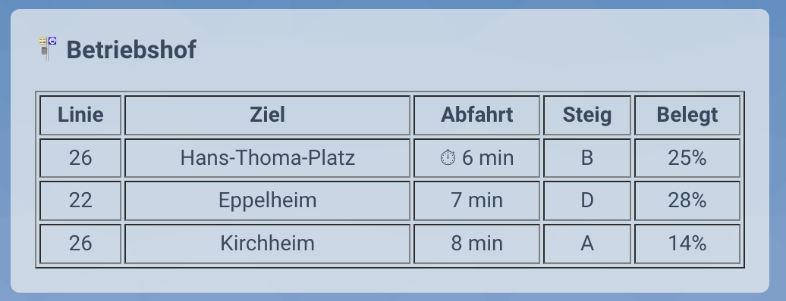

[![GitHub Release][releases-shield]][releases]
[![Maintainer][maintainer-shield]][maintainer]
[![HACS Custom][hacs-shield]][hacs-url]
[![GitHub Downloads][downloads]][downloads]


# Home Assistant Motis Integration

This custom hacs-default integration adds support for real-time public transport departures from **Transitous** to Home Assistant, using the [Motis API](https://transitous.org/api/).

It allows you to monitor upcoming departures for stations, with optional filtering by **platforms** and **lines**.  
Each configured station is represented as a device with separate entities for the **next three departures**.

## Installation
[](https://my.home-assistant.io/redirect/hacs_repository/?owner=herrlevin&repository=homeassistant-motis&category=integration)

This integration is now available as a **default HACS repository**!

1. Install [HACS](https://hacs.xyz/) if you haven't already.
2. In HACS, go to **Integrations → ⋮ → Custom repositories**.
3. Add this repository as a [custom integration repository](https://hacs.xyz/docs/faq/custom_repositories):  
    - [https://github.com/herrlevin/homeassistant-motis](https://github.com/herrlevin/homeassistant-motis)
    - Set the category to `Integration`.
4. Restart Home Assistant

## Configuration

After installation, add the integration to Home Assistant (Requesting the first access token may take a while):

[](https://my.home-assistant.io/redirect/config_flow_start/?domain=motis)

Or manually:

1. Go to **Settings → Devices & Services → + Add Integration**  
2. Search for **Motis**  
3. Follow the setup flow  

### Options

You can customize the integration after setup by managing stations through the options flow:

1. Go to **Settings → Devices & Services**.
2. Find **Motis Public Transport** and click the **cog (⚙️) icon** to open Options.

Inside the options menu, you can:

#### **Add a station:**  
Enter the station name and click submit.
Select the correct station from a drop down and optionally specify platforms and lines to monitor.  

#### **Remove a station:**  
Select a station from your saved list to remove it (this also deletes associated devices).

#### **Save and exit:**  
Apply your changes and close the options menu.

## Examples
Below are two examples showing upcoming Motis public transport departures in Home Assistant:


## Example Frontend Card
Using the markdown card in Home Assistant an overview like this can be generated:


Use this code to replicate the card in Home Assistant. You only have to change the heading and your RNV sensor names:
```
type: markdown
content: |
  <h3>🚏 Departures</h1>

  

  <table border="1" width="100%" cellspacing="0" cellpadding="4">
    <tr>
      <th align="center">Line</th>
      <th align="center">Destination</th>
      <th align="center">Departure</th>
      <th align="center">Platform</th>
    </tr>
    
      
      
        <tr>
          <td align="center" style="color: {{ state.attributes.route_text_color }}">
          {{ state.attributes.label }}
          </td>
          <td align="center">{{ state.attributes.destination }}</td>
          <td align="center">
            
            {{ state.attributes.time_until_departure }}
            
            {{ state.attributes.realtime_time_local or (state.attributes.realtime_time | default(state.attributes.planned_time) | as_timestamp | timestamp_custom('%H:%M')) }}
            
  
          </td>
          <td align="center">{{ state.attributes.platform or '-' }}</td>
        </tr>
      
    
  </table>
```

For a German Version:



```
type: markdown
content: |
  <h3>🚏 Haltestelle</h1>

  

  <table border="1" width="100%" cellspacing="0" cellpadding="4">
    <tr>
      <th align="center">Linie</th>
      <th align="center">Ziel</th>
      <th align="center">Abfahrt</th>
      <th align="center">Steig</th>
    </tr>
    
      
      
        <tr>
          <td align="center" style="color: {{ state.attributes.route_text_color }}">
          {{ state.attributes.label }}
          </td>
          <td align="center">{{ state.attributes.destination }}</td>
          <td align="center">
            
            {{ state.attributes.time_until_departure }}
            
            {{ state.attributes.realtime_time_local or (state.attributes.realtime_time | default(state.attributes.planned_time) | as_timestamp | timestamp_custom('%H:%M')) }}
            

          </td>
          <td align="center">{{ state.attributes.platform or '-' }}</td>
        </tr>
      
    
  </table>
```

## License

This project is licensed under the [MIT License](./LICENSE),  
Forked from and based on the [Home Assistant RNV integration](https://github.com/mirko-sommer/homeassistant-rnv).

> **Disclaimer:** This project is an independent community integration and is not affiliated with or endorsed by Motis / Transitous.

[releases-shield]: https://img.shields.io/github/release/herrlevin/homeassistant-motis.svg?style=for-the-badge
[releases]: https://github.com/herrlevin/homeassistant-motis/releases

[maintainer-shield]: https://img.shields.io/badge/maintainer-herrlevin-blue.svg?style=for-the-badge
[maintainer]: https://github.com/herrlevin

[hacs-shield]: https://img.shields.io/badge/HACS-Default-orange.svg?style=for-the-badge
[hacs-url]: https://github.com/herrlevin/homeassistant-motis

[downloads]: https://img.shields.io/github/downloads/herrlevin/homeassistant-motis/total?style=for-the-badge
